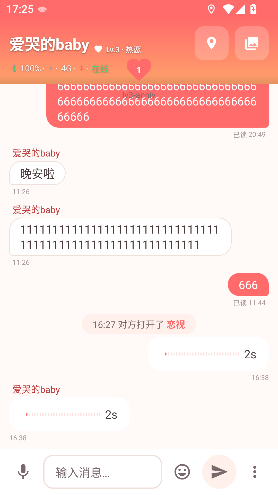
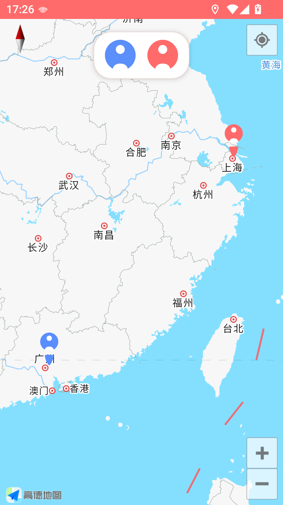
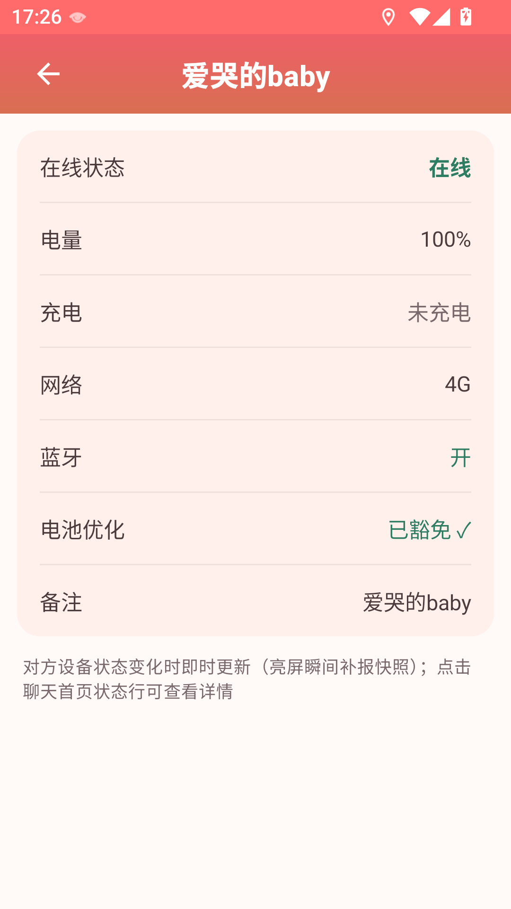
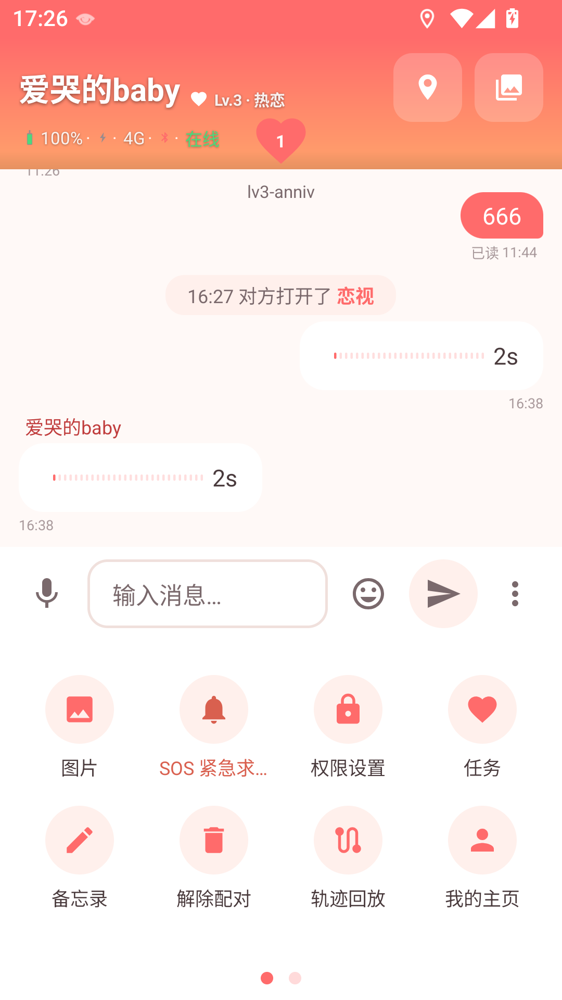
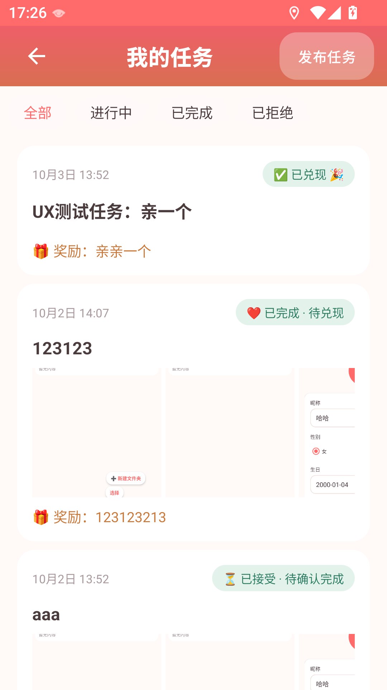

# 恋视（EyeMonitor）

> 情侣之间的互相守护：实时知道对方在用什么 App、人在哪里、此刻好不好。
>
> **Demo 级验证项目** —— 仅供双方知情同意的情侣/密友使用，请务必阅读文末《伦理与合规声明》。

配对的两台 Android 手机通过私有后端实时互看对方打开的 App 与实时位置，并内置聊天、语音、图片/视频、好感度等级、情侣任务、备忘录、纪念日、电子围栏、SOS 求助等完整的情侣互动能力。客户端为纯 Java + XML（无 Kotlin / Compose），后端为 Spring Boot 3.3（Java 17）+ MySQL，WebSocket 实时双向通信。



| 快速事实 | |
|---|---|
| App 名称 / 包名 | 恋视 · `com.eyemonitor` |
| 当前版本 | 1.0.2（versionCode 3） |
| 最低系统 | Android 7.0（minSdk 24，targetSdk 34） |
| 客户端 | Java + XML · OkHttp WebSocket · Room · 高德地图 SDK |
| 后端 | Spring Boot 3.3（Java 17）· 原生 WebSocket（非 STOMP） |
| 数据库 | MySQL 5.7 / 8.0（JPA 自动建表） |
| 实时通道 | WebSocket `/ws/eye`（云端为 `wss://域名:18443/ws/eye`） |

---

## 目录

- [项目简介](#一项目简介)
- [功能特性](#二功能特性)
- [界面预览](#三界面预览)
- [技术架构](#四技术架构)
- [快速开始](#五快速开始)
- [云端部署](#六云端部署)
- [Android 权限说明](#七android-权限说明)
- [使用指南](#八使用指南)
- [通信协议](#九通信协议)
- [项目结构](#十项目结构)
- [持续集成](#十一持续集成)
- [开发脚本](#十二开发脚本)
- [常见问题](#十三常见问题)
- [隐私与数据安全](#十四隐私与数据安全)
- [伦理与合规声明](#十五伦理与合规声明)
- [License](#十六license)

---

## 一、项目简介

**它解决什么问题**：异地情侣、密友之间，常常只能靠反复询问「你在干嘛？在哪儿？」来确认彼此的近况。恋视把「实时可见」这件事自动化——对方切换了 App、移动到了哪里、手机还剩多少电、此刻是否在线，都实时同步到你这边；聊天、打卡、任务、纪念日等互动功能，则让守护不止于监控、更有温度。

**它不是什么**：

- **不是无授权监控工具**——使用前提是双方知情同意（见文末声明）；
- **不是公网 SaaS**——所有敏感数据存于你们自己的私有后端（本地开发或自购云服务器），不经过任何第三方平台。

## 二、功能特性

| 功能 | 说明 |
|---|---|
| 🐾 **App 使用监控** | 实时查看对方打开了什么 App。双通道采集：「使用情况访问」（系统授权）轮询 + 无障碍服务实时监听（可选增强）；切换 App 触发系统通知提醒 |
| 📍 **实时位置** | 高德地图实时共享对方位置。高德 SDK + 系统定位（LocationManager）双通道，无高德 Key 时系统定位兜底仍可用；亮屏每 30s 采样、息屏降频至 90s；静止去重（位移 < 20m 跳过）、常规位移最小上报间隔 60s、大位移（> 200m，行车/高铁场景）即时上报 |
| 💬 **双人聊天** | QQ 风格聊天：文本、语音（按住说话 + 波形）、图片/视频；支持引用、撤回（2 分钟内）、已读回执、失败重发；聊天记录服务端持久化 + 本地 Room 缓存 |
| 💗 **好感度等级** | Lv.1–6 共同成长体系：聊天回合、早安/晚安打卡、情侣任务、SOS 回执、纪念日、同时在线、连续配对天数均可加分（每日上限 50 分）；升级是双端共同事件，等级徽章与进度常驻聊天页 |
| 🎨 **主题皮肤** | 「珊瑚恋语」默认主题 + 「狗狗乐园」自制 PNG 主题（手绘气泡耳爪 / 头栏底图 / 全套图标 / 语音条），Lv.3 解锁，双端各自切换互不影响 |
| 💌 **情侣任务** | 打卡（早安 5:00–11:00 / 晚安 19:00–24:00 问候）、任务发布 / 接受 / 拒绝 / 完成 / 奖励兑现全流程双向同步，支持图文任务（可附图片）|
| 📝 **备忘录** | 双人共享备忘录，支持条目化管理与提醒 |
| 🎂 **纪念日** | 记录重要日子（一次性或每年重复），到期系统提醒 |
| 🚨 **SOS 紧急求助** | 一键发送求助（可附带实时位置），对方可回执「我已安全」，求助留痕落库 |
| ⭕ **电子围栏** | 自定义围栏（半径 100m – 50km），对方进出围栏实时提醒（同方向 60s 去重防抖）|
| 🔋 **设备状态** | 对方电量、充电中、网络类型、在线状态、蓝牙开关五件套实时展示 |
| 🗺️ **轨迹回放** | 位置历史轨迹按设备查看回放 |
| 🔒 **隐私控制** | 通知 / 定位 / 电池优化白名单均有明确授权流程，所有敏感权限可随时在系统设置中收回 |

## 三、界面预览

| 聊天页（狗狗乐园主题，气泡耳爪装饰） | 实时地图 | 设备状态 |
|---|---|---|
|  |  |  |

| 更多面板 | 情侣任务 | 备忘录 |
|---|---|---|
|  |  |  |

## 四、技术架构

```
设备 A ──► 事件采集（App 监控 / 双通道定位 / 设备状态）
              │
              ▼
          WSClient(OkHttp) ──► Spring Boot 后端（/ws/eye，JWT 握手鉴权）
                                     │ 按 pairCode 双向转发
设备 B ──► WSClient ◄────────────────┘
媒体文件：REST POST /api/media/upload 上传 → 成功后 WS 广播元数据
消息类型：app_switch / location / chat / media / device_status / sos /
          task_publish~task_reward / check_in / affection_sync /
          anniversary_sync / fence_sync / user_profile / ping ...
```

| 层 | 技术 |
|---|---|
| Android 客户端 | Java 17 + XML（无 Kotlin/Compose）· OkHttp 4.12（WebSocket + HTTP）· Gson · Room 2.6（本地缓存）· 高德 3D 地图 SDK（含定位/搜索）· Glide · WorkManager 保活 · 自定义 lint 规则模块 |
| 后端 | Spring Boot 3.3（Java 17）· spring-boot-starter-websocket（原生 WS，非 STOMP）· JPA/Hibernate · JJWT · BCrypt（仅 spring-security-crypto，不引安全全家桶）|
| 数据库 | MySQL 8.0（容器）/ 5.7+（本地）· JPA `ddl-auto=update` 自动建表 |
| 部署 | Docker Compose（mysql + app + nginx 三容器）· nginx WSS TLS 终结 · 非 root 运行（uid 10001）|

**安全设计要点**：

| 措施 | 说明 |
|---|---|
| JWT 双 token | access 8 小时 / refresh 30 天滑动续期；单设备登录（token 族版本号，重新登录后旧 token 全部失效）|
| WS 握手鉴权 | HandshakeInterceptor 校验 access token（`X-Auth-Token` 请求头，兼容 `?token=` 过渡期），失败返回 403 拒绝握手 |
| REST 鉴权 | `/api/**` 统一 AuthInterceptor 拦截（`/api/auth/**` 除外）|
| 配对防枚举 | 6 位配对码 + 尝试限流（10 次/小时失败锁定 30 分钟）+ PENDING 状态 30 分钟过期 |
| 配对持久化 | 配对关系真源在 MySQL（`eye_pairs`），服务器重启后从数据库恢复，设备经 `pair_recover` 自动恢复会话 |
| 凭据强校验 | `ProdCredentialValidator` 启动强校验：环境变量缺失 / 历史默认值 / root 账号 / JWT_SECRET < 32 字节一律拒停 |
| 数据库隔离 | 应用使用低权限账号（仅授权 `eye_monitor` 库），root 密码仅容器内维护用 |
| 日志脱敏 | nginx 自定义日志格式只记录请求路径，不记录 query（防 `?token=` 落入访问日志）|
| 数据保留 | 聊天 / 轨迹 / SOS 日志按保留期自动清理；媒体文件豁免清理、永久保留，解除配对时清空 |

## 五、快速开始

> ⚠️ **先说清楚**："克隆 → 跑命令"并不是零前提。Android 构建需要 JDK 17 + Android SDK，后端需要 JDK 17 + Maven + **正在运行的 MySQL**。下面每一步都写了检查方式和常见报错，照着做不会卡壳。

### 5.1 前置检查清单（先花 2 分钟确认）

```bash
# 1) JDK 必须是 17（Gradle 8.5 不兼容 JDK 22+，会报 Unsupported class file major version 66）
java -version        # 期望 17.x

# 2) Android SDK（Android Studio 装了就有；命令行需能定位 SDK）
echo $ANDROID_HOME   # Windows: echo %ANDROID_HOME%，或首次构建前写好 local.properties 的 sdk.dir

# 3) MySQL 必须已启动（后端强依赖，没起会秒挂）
mysqladmin ping -u eye -p   # 或本机服务/容器里确认 3306 在监听

# 4) 网络：首次构建需要下载 Gradle wrapper 与 Maven 依赖
```

> 提示：`android/gradle.properties` 中不要写本机专属的 `org.gradle.java.home` 路径（CI 会自动剥离该行，但会影响你在其他机器上的可移植性）；项目级配置仅保留内存参数与 AndroidX 开关。

### 5.2 环境要求

| 依赖 | 版本 | 用途 |
|---|---|---|
| JDK | **17** | Android 构建 + 后端运行（Gradle 8.5 不兼容 22+）|
| Android SDK | compileSdk 34 / build-tools 34 | Android 构建 |
| Maven | 3.8+ | 后端构建 |
| MySQL | 5.7 / 8.0 | 后端数据存储（**需先行启动并建库**）|
| Android 设备 | Android 7.0+（建议两台真机）| 运行 |

### 5.3 构建 Android APK

```bash
cd android
./gradlew assembleDebug          # Windows: gradlew.bat assembleDebug
```

**首次构建会自动**：下载 Gradle 8.5 发行版 → 下载项目依赖（OkHttp/Gson/Room/高德 SDK 等）→ 编译打包。产物：`android/app/build/outputs/apk/debug/app-debug.apk`（默认仅打包 `armeabi-v7a` / `arm64-v8a` 两种 ARM 架构）。

```bash
adb install -r android/app/build/outputs/apk/debug/app-debug.apk
```

**关于高德 Key（重要）**：缺失**不阻断构建**——`loadAmapKey()` 找不到 Key 时只打印警告、注入空占位符，APK 照常生成。Key 支持三处注入（按优先级）：`local.properties` 的 `amap.key` → Gradle 属性 `amapKey`（`-PamapKey=xxx` 或 `~/.gradle/gradle.properties`）→ 环境变量 `AMAP_KEY`（CI 用）。未配置 Key 时仅地图页不可用，系统定位兜底通道仍可上报位置。

```properties
## android/local.properties（本机配置，勿提交；Android Studio 打开项目会自动生成基础版）
# Android SDK 路径（必填，否则报 "SDK location not found"）
sdk.dir=C:\Users\你的用户名\AppData\Local\Android\Sdk

# 高德地图 Key（可选：无 Key 时地图不可用，系统定位仍工作）
# 申请地址：https://console.amap.com —— 创建应用后获取，包名需填 com.eyemonitor
amap.key=你的高德Key

# 可选：本机 JDK 非 17 时钉到 JDK 17（避免 Unsupported class file major version 66）
org.gradle.java.home=C:\Program Files\Java\jdk-17.0.2
```

> `local.properties` 已被 `.gitignore` 忽略，永远不要提交。CI 环境通过 GitHub Actions 的 `secrets.AMAP_KEY` 注入（见第十一章）。

### 5.4 启动后端（本地开发）

**前提顺序不能乱**：① MySQL 已启动并建库 → ② 写好 `server/.env` → ③ 启动。

**第 0 步：建库建账号（一次性）**

```sql
CREATE DATABASE IF NOT EXISTS eye_monitor DEFAULT CHARSET utf8mb4;
CREATE USER IF NOT EXISTS 'eye'@'%' IDENTIFIED BY '<你的DB_PASS>';
GRANT ALL PRIVILEGES ON eye_monitor.* TO 'eye'@'%';
FLUSH PRIVILEGES;
```

> 表结构由后端启动时自动创建（JPA ddl-auto），无需手工导 SQL。

**第 1 步：配置环境变量**（后端启动强校验，缺失 / 弱默认值会拒停）

```bash
cd server
cp .env.example .env        # 复制模板
# 然后编辑 .env，把 REPLACE_WITH_* 换成强随机值：
#   openssl rand -base64 48    （Git Bash / PowerShell 均可）
```

`.env` 示例（**每个值都必须替换**）：

```properties
# ==== server/.env（已被 gitignore，勿提交）====
DB_USER=eye                        # MySQL 应用账号（仅授权 eye_monitor 库）
DB_PASS=生成的强随机密码             # 与第 0 步建账号的密码一致
DB_ROOT_PASS=另一个强随机值          # 仅容器内维护用
JWT_SECRET=至少32字节的随机串         # JWT 签名密钥（HS256，<32 字节会被拒停）
# 云端部署时取消注释并填：
# SERVER_URL=wss://<你的域名>:18443/ws/eye
```

**第 2 步：启动**

```bash
cd server
bash scripts/start-local-server.sh        # Linux/macOS（自动读 .env 注入）
# Windows PowerShell:  scripts/start-local-server.ps1
# 或手动：
# DB_USER=eye DB_PASS=<密码> JWT_SECRET=<密钥> mvn spring-boot:run
```

- 监听 `8080`，WebSocket 端点 `ws://<局域网IP>:8080/ws/eye`
- 验证：连上 WS 后发送 `{"type":"pair_request","deviceId":"<设备UUID>"}`，应返回 6 位配对码
- 手机端「设置 → 服务器地址」填 `ws://<电脑局域网IP>:8080/ws/eye`（同一局域网，防火墙放行 8080）

**常见启动报错对照**：

| 报错 | 原因 | 解决 |
|---|---|---|
| `Unsupported class file major version 66` | 默认 JDK 是 22+ | 装 JDK 17；local.properties 钉 `java.home` |
| `SDK location not found` | local.properties 缺 sdk.dir / 未设 ANDROID_HOME | 补 `sdk.dir` |
| `Failed to configure a DataSource` / HikariPool 连接失败 | MySQL 没起 / 库没建 / 密码不对 | 按第 0 步建库，确认 3306 监听 |
| 启动被 ProdCredentialValidator 拒停 | 环境变量缺失或为默认/弱值 | 用 `openssl rand -base64 48` 生成强值重试 |
| 手机连不上 `ws://` | 不在同一网段 / 防火墙拦 8080 | 同一 Wi-Fi；放行端口；或走云端 `wss://` |

## 六、云端部署

> 云端 ≠ 本地跑 Docker。走 WSS 需要**域名 + TLS 证书 + 安全组放行**，部署前请通读本节。

### 6.1 准备（一次性）

| 项 | 说明 |
|---|---|
| 云服务器 ECS | 建议 2C4G+，系统 Ubuntu 22.04 / Debian 12 / CentOS 7+ |
| 域名 | WSS 必须走 HTTPS，需要域名 |
| TLS 证书 | 阿里云免费证书 / Let's Encrypt（certbot）均可 |
| 安全组/防火墙 | 放行 **TCP 18443**（WSS 入口）+ 22（运维 SSH）|

> **端口说明**：默认走 **18443**（非标端口，国内云免备案阶段可用；备案通过后 nginx 配置可切回 443/80——`nginx.conf` 中已有注释指引，请自行启用）。

### 6.2 服务器环境

```bash
# 安装 Docker + Compose 插件
curl -fsSL https://get.docker.com | sh
sudo systemctl enable --now docker
sudo apt install docker-compose-plugin   # Debian/Ubuntu

# 确认
docker compose version
```

### 6.3 准备证书与配置

```bash
cd server
cp .env.example .env

# 1) 编辑 .env：把 DB_PASS / DB_ROOT_PASS / JWT_SECRET 换成强随机值
#    openssl rand -base64 48

# 2) 放置 TLS 证书（gitignored，不提交仓库）：
mkdir -p certs
#    server/certs/fullchain.pem
#    server/certs/privkey.pem
#    （阿里云证书：下载 Nginx 版解压；Let's Encrypt：certbot certonly --standalone -d 你的域名）

# 3) 替换 nginx 示例域名（nginx/nginx.conf 中 80 与 18443 两个 server 块各有 1 处 server_name）：
grep -n server_name nginx/nginx.conf   # 先查看示例域名所在行
#    用编辑器把两处 server_name 后的示例域名替换为你的域名

# 4) 预检 nginx 配置（证书缺失会导致 nginx crash-loop，先自检）
docker run --rm \
  -v $PWD/nginx/nginx.conf:/etc/nginx/conf.d/default.conf:ro \
  -v $PWD/certs:/etc/nginx/certs:ro \
  nginx:1.27-alpine nginx -t
```

### 6.4 部署

```bash
cd server
docker compose up -d --build

# 查看状态（mysql/app/nginx 三个容器应全部 running）
docker compose ps
# 日志
docker compose logs -f
```

### 6.5 验证

```bash
# 1) 本机验收：app 的 8080 仅绑定 127.0.0.1（运维本机），REST 端点存在即服务正常：
curl -i http://127.0.0.1:8080/api/auth/login
#    期望 HTTP 405 Method Not Allowed（GET 打到仅允许 POST 的端点 = 服务已就绪）
#    若返回 502/000 则 MySQL 或应用未起来，看 docker compose logs app

# 2) 手机端：服务器地址填
#    wss://你的域名:18443/ws/eye
#    连接成功 → 发 pair_request 应返回 6 位码

# 3) 手机端连不上时：
#    - 安全组是否放行 18443（阿里云/腾讯云控制台）
#    - 域名 DNS 是否解析到 ECS 公网 IP
#    - docker compose logs nginx 查看 TLS 握手是否正常
```

### 6.6 部署架构与安全说明

```
手机 ──wss://域名:18443──► nginx(18443, TLS 终结)
                              └──► app:8080（容器内网，仅绑 127.0.0.1 供运维验收）
mysql:3306（容器内网，不发布端口，公网/宿主机扫不到）
```

| 安全点 | 说明 |
|---|---|
| MySQL 不发布端口 | 仅 compose 内网可达 |
| app 8080 仅绑 127.0.0.1 | 手机端一律走 nginx WSS（公网端口扫描 0 开放）|
| 凭据全部来自 `.env` | gitignored；启动强校验拒弱默认值 |
| 非 root 运行 | 应用容器内以 uid 10001 运行（AC8）|
| 媒体持久化 | `media-data` 卷（解除配对会清空 media）|
| 上传大小 | 后端 multipart 110MB/120MB，nginx 已配 `client_max_body_size 110m`（默认 1MB 会 413）|
| 日志脱敏 | nginx 自定义日志格式只记路径，不记录 query（防 `?token=` 落日志）|

### 6.7 部署后安全自检清单（上线前必做）

部署完成 ≠ 安全。按下面清单逐项自检，任何一项不通过都应先修复再使用：

| # | 检查项 | 方法 | 通过标准 |
|---|---|---|---|
| 1 | **端口暴露面** | 在线端口扫描（shodan.io / yougetsignal.com）或 `nmap -Pn <公网IP>` | 公网**只能看到 18443**（+22 可选）；出现 8080 / 3306 即失败 |
| 2 | **TLS 证书有效** | `openssl s_client -connect 你的域名:18443 -servername 你的域名 </dev/null 2>&1 | grep -E "Verify return code|subject"` | `Verify return code: 0`；证书域名匹配 |
| 3 | **WS 握手鉴权** | 不带 token 发起 Upgrade：`curl -vk "wss://你的域名:18443/ws/eye" 2>&1 | grep -iE "401|403"` | 无 token 必须被拒（401/403），不能握手成功 |
| 4 | **弱凭据已替换** | 服务器上 `grep -cE "REPLACE_WITH|123456|password" .env` | 输出 0；全部为强随机值 |
| 5 | **配对限流生效** | 连续错误输入配对码 10+ 次 | 触发锁定（30 分钟拒绝），日志有记录 |
| 6 | **日志无明文敏感信息** | `docker compose logs app | grep -iE "token|password"` | 无明文 token/密码；nginx 日志只记 `$uri` 不含 query |
| 7 | **数据库不对外** | 公网扫 3306；或 `docker compose ps` 确认 mysql 无端口映射 | 公网扫不到；mysql 仅 compose 内网 |
| 8 | **上传限制** | 上传 >1MB 媒体 | 应成功（nginx `client_max_body_size 110m`）；413 = 配置未生效 |
| 9 | **重启自愈** | `docker compose restart app nginx` | 容器自动恢复、WS 重连成功 |

> 至少通过 1/2/3/4 四项再让手机端连入；其余项纳入每周巡检。

### 6.8 运维

```bash
# 更新发布：git pull → 重建
docker compose up -d --build

# 重启单个服务
docker compose restart app

# 备份 MySQL 数据卷（卷名取决于 compose 项目名，先确认）
docker volume ls | grep mysql-data
docker run --rm -v <实际卷名>:/data -v $PWD/backup:/backup alpine \
  sh -c "cd /data && tar czf /backup/mysql-$(date +%F).tar.gz ."

# 媒体数据卷同理（grep media-data），如需整体迁移可一并打包

# 证书续期后重启 nginx 加载新证书
docker compose restart nginx
```

### 6.8 手动部署（无 Docker）

```bash
cd server && mvn package
DB_USER=eye DB_PASS=<密码> JWT_SECRET=<密钥> \
  java -jar target/eye-monitor-server-0.0.1-SNAPSHOT.jar
```

> 手动方式需自行准备 MySQL、TLS 终结（可宿主机直装 nginx）与守护进程（systemd）；Docker 方式免去这些。

## 七、Android 权限说明

| 权限 | 用途 | 获取方式 |
|---|---|---|
| 使用情况访问（PACKAGE_USAGE_STATS）| 监控对方 App | 系统设置手动开启（App 内跳转引导）；调试可用 `scripts/grant-dev-permissions.bat` 一键授予 |
| 无障碍服务 | 实时 App 切换监听（增强，可选）| 系统设置开启；开启后使用情况轮询自动降频至 60s |
| 通知（POST_NOTIFICATIONS）| 切换 App / 消息提醒 | Android 13+ 运行时申请 |
| 定位（FINE + BACKGROUND）| 位置共享 | 运行时申请；后台定位需系统单独授权 |
| 麦克风（RECORD_AUDIO）| 语音消息 | 按住说话时申请 |
| 媒体访问（READ_MEDIA_IMAGES / READ_MEDIA_VIDEO）| 发送图片/视频 | Android 13+ 选择文件时系统授权；Android 12 及以下为 READ_EXTERNAL_STORAGE |
| 蓝牙（BLUETOOTH_CONNECT）| 设备状态中的蓝牙信息展示 | 清单声明，Android 12+ 需运行时授权 |
| 电池优化白名单 | 后台监控存活 | 首次开启监控引导一次（拒绝后不再打扰）|
| 开机自启（RECEIVE_BOOT_COMPLETED）| 开机恢复监控 | 系统设置允许自启动 |

> 保活机制：前台服务（FOREGROUND_SERVICE_SPECIAL_USE）持续运行 + WorkManager 周期自检拉起 + 开机自启，锁屏状态下监控与消息收发照常。

## 八、使用指南

### 首次使用（两台手机各做一遍）

1. **安装并登录**：安装 APK → 打开 → 注册/登录账号（密码 BCrypt 加密存储；同一账号单设备登录，重登会使旧设备 token 失效）
2. **设置服务器地址**（关键，缺这步一切连不上）：
   - 进入「设置 → 服务器地址」，填你后端的 WebSocket 地址：
     - 本地部署：`ws://<电脑局域网IP>:8080/ws/eye`（手机与电脑同一 Wi-Fi）
     - 云端部署：`wss://你的域名:18443/ws/eye`
   - 地址必须以 `ws://` 或 `wss://` 开头；保存后重启 App 生效
3. **验证连通**：头栏状态应显示「在线」；显示离线则依次排查：地址是否正确、服务器是否启动、同一网段/防火墙、安全组

### 配对与日常使用

1. **注册登录**：两台手机各自注册账号（密码 BCrypt 加密存储；同一账号单设备登录，重新登录会使旧设备 token 失效）
2. **配对**：一台「创建配对」得到 6 位码 → 另一台输入确认 → 建立连接。配对关系持久化在服务端 MySQL，服务器重启后设备自动恢复会话（`pair_recover`），**无需重新配对**；换机登录则需重新绑定
3. **开启监控**：授权「使用情况访问」+ 通知 → 打开监控服务开关（前台服务持续运行，锁屏也有效；建议加入电池优化白名单）
4. **聊天**：首页即聊天页，文本/语音/图片/视频，长按消息可引用/撤回（2 分钟内）
5. **地图**：头栏地图按钮查看对方实时位置与轨迹回放
6. **好感度与主题**：聊天互动与打卡积累好感度 → 升级解锁「狗狗乐园」主题（Lv.3）→ 点击等级徽章切换皮肤
7. **设备状态**：头栏状态行查看对方电量/充电/网络/在线/蓝牙；更多面板进入任务/备忘录/纪念日/围栏/轨迹回放

## 九、通信协议

WebSocket 消息统一结构（双端 `WsMessage` 字段完全一致）：

```json
{
  "type": "chat",
  "deviceId": "设备UUID",
  "pairCode": "6位配对码",
  "payload": { "text": "消息内容", "from": "昵称" },
  "timestamp": 1728000000000
}
```

**核心消息类型**：

| type | 方向 | 说明 |
|---|---|---|
| `pair_request` / `pair_recover` | C→S | 创建配对 / 重启后恢复会话 |
| `app_switch` | C→S | App 切换事件（packageName / appName / action）|
| `location` | C→S | 位置上报（lat / lng / accuracy）|
| `request_peer_location` | C→S | 请求对方立即上报位置 |
| `chat` / `typing` / `chat_read` / `chat_recall` | 双向 | 聊天消息 / 输入中 / 已读回执 / 撤回 |
| `media` / `media_deleted` | 双向 | 媒体元数据广播（文件本体经 REST 上传）|
| `device_status` | C→S | 设备状态五件套（电量/充电/网络/在线/蓝牙）|
| `sos` / `sos_ack` | 双向 | 紧急求助（可附带位置）/ 我已安全回执 |
| `check_in` | C→S | 早安（5:00–11:00）/ 晚安（19:00–24:00）打卡 |
| `task_publish` / `task_respond` / `task_complete` / `task_reward` | 双向 | 情侣任务全生命周期（taskId 客户端幂等键）|
| `anniversary_sync` / `fence_sync` | 双向 | 纪念日 / 电子围栏变更广播 |
| `affection_sync` | S→C | 好感度快照（points / level / title / progress）|
| `user_profile` | 双向 | 资料变更广播（昵称/头像/性别/生日/签名）|
| `ping` / `pong` | 双向 | 心跳保活 |

**传输细节**：

- 心跳：亮屏 30s / 息屏 120s；断线指数退避自动重连（1s 起步，上限 30s）
- 聊天/媒体消息按 `pairCode` 路由给对方；媒体文件走 REST（`POST /api/media/upload`），上传成功后再经 WS 广播元数据
- 好感度/任务/备忘录/围栏/纪念日以服务端为真源（MySQL），本地 Room 缓存离线可读；好感度另有 `GET /api/affection` REST 兜底拉取
- WS 握手鉴权：请求头 `X-Auth-Token` 携带 access token（兼容 `?token=` 过渡期），校验失败返回 403

## 十、项目结构

```
eye-monitor/
├── android/                          # Android 客户端（Gradle 8.5）
│   ├── app/src/main/
│   │   ├── java/com/eyemonitor/
│   │   │   ├── ui/                   # 聊天/地图/配对/任务/备忘录/纪念日/资料/轨迹回放 等页面
│   │   │   ├── service/              # 监控前台服务、无障碍、双通道定位、围栏判定、保活
│   │   │   ├── websocket/            # OkHttp WebSocket 客户端（心跳 + 指数退避重连）
│   │   │   ├── db/                   # Room（聊天/媒体/好感度/任务/备忘录/围栏缓存）
│   │   │   ├── config/               # 偏好设置（配对/主题/昵称/服务器地址）
│   │   │   └── util/                 # 权限引导/波形/地图/纪念日 等工具
│   │   └── res/                      # 布局/资源/主题素材（drawable-xxhdpi 手绘 PNG）
│   ├── lintchecks/                   # 自定义 lint 规则（UI 样式护栏）
│   └── gradle.properties             # 项目级 Gradle 配置（UTF-8 / AndroidX）
├── server/                           # Spring Boot 后端（Maven）
│   ├── src/main/java/com/eyemonitor/
│   │   ├── handler/                  # WS 消息分发（EyeWebSocketHandler）
│   │   ├── service/                  # 配对路由/好感度/任务/媒体/消息存储/数据清理
│   │   ├── controller/               # REST API（/api/auth /api/pairs /api/affection /api/media ...）
│   │   ├── security/                 # JWT、WS 握手鉴权、REST 鉴权、会话管理
│   │   └── config/                   # WS 注册、凭据强校验、安全响应头
│   ├── Dockerfile                    # 多阶段构建，非 root 运行（uid 10001）
│   ├── docker-compose.yml            # 云端一键部署（MySQL + 应用 + nginx）
│   ├── nginx/nginx.conf              # WSS TLS 终结配置
│   └── settings.xml                  # 阿里云 Maven 镜像（国内构建加速）
├── scripts/                          # 开发脚本（见第十二章）
├── screenshots/                      # README 界面截图
└── .github/workflows/ci.yml          # CI 门禁
```

## 十一、持续集成

`.github/workflows/ci.yml`：push / PR 到 `main` 时自动执行，双端并行，任一 Job 失败即阻断合并。

- **Server**：`maven:3.9-eclipse-temurin-17` 容器内 `mvn test` + `mvn package`
- **Android**：Temurin 17 → 自动剥离本地 `gradle.properties` 中硬编码的 `org.gradle.java.home`（如有）→ `assembleDebug` + 单元测试 + `lintDebug`
- **高德 Key**：CI 通过 GitHub Secrets 的 `AMAP_KEY` 注入（未配置不阻断构建，仅地图不可用）
- **质量门禁**：自定义 `lintchecks` 规则 + `checkUiStyle` 任务（拦截布局中裸 Button 与硬编码色值，已挂接 preBuild，违规即构建失败）；lint 存量问题非阻断（`abortOnError false`）

## 十二、开发脚本

| 脚本 | 用途 |
|---|---|
| `scripts/grant-dev-permissions.bat` | 调试机一键授予通知/定位/后台定位/使用情况访问/无障碍权限（部分系统限制项需手动）|
| `scripts/start-local-server.sh` / `.ps1` | 本地后端启动：读取 `server/.env` 注入 DB_USER/DB_PASS/JWT_SECRET 后执行 `mvn spring-boot:run` |
| `scripts/deploy-server.sh` | 云端一键重新部署：本地打包（排除 .env/日志/数据）→ scp → `docker compose up -d --build` → 验收 18443 端点 |
| `scripts/battery-baseline.sh` | 省电策略验收基线（息屏降频/心跳节奏对照）|
| `scripts/ux_task_test.py` | 后端好感度/任务接口验收测试 |

## 十三、常见问题

| 问题 | 解决 |
|---|---|
| 地图不显示 | 检查 `local.properties` 的 `amap.key`（需与签名/包名 `com.eyemonitor` 匹配）；模拟器可用 `adb emu geo fix <lng> <lat>` 注入位置，走系统定位通道 |
| 对方切换 App 无提醒 | 「使用情况访问」未开 / 通知权限未授 / 监控服务未在前台运行 |
| 收不到聊天/通知 | 检查服务器地址（`ws://` 或 `wss://` 开头）、配对码是否一致、是否在电池优化白名单（防系统杀后台）|
| 息屏后位置不更新 | 属省电策略：息屏定位降频至 90s 档，亮屏立即恢复并追发快照 |
| 后端启动被拒停 | 环境变量缺失或弱默认值 → `openssl rand -base64 48` 生成强值后重试 |
| 服务器重启后要重新配对吗 | 不需要：配对关系持久化于 MySQL，设备会自动 `pair_recover` 恢复会话；换机登录才需重新绑定 |
| 图片/视频发送失败（HTTP 413）| nginx `client_max_body_size 110m` 与后端 multipart 110MB/120MB 上限，超大文件请压缩后重发 |
| WS 握手被拒（403）| access token 过期或已换设备登录（单设备登录，token 族版本失效）→ 重新登录 |
| 配对提示"尝试过于频繁" | 防暴力枚举限流：10 次/小时失败将锁定 30 分钟，稍后再试 |
| Windows 下中文乱码 | 请勿移除 `-Dfile.encoding=UTF-8`（启动脚本与 Dockerfile 已内置），代码文件保持 UTF-8 |

## 十四、隐私与数据安全

> 核心回答：**聊天记录、位置、语音等内容只会到达你自己的服务器**，不会经过第三方；但它们是否"绝对安全"取决于你的部署方式与服务器安全。下面说清楚数据流向、威胁模型与你的责任。

### 14.1 数据流向（谁碰得到）

```
你 ──(TLS 加密，云端)──► 你的服务器(nginx) ──► 后端(MySQL/磁盘)
  └──(局域网明文，本地部署)──► 你的电脑
```

| 数据 | 存放位置 | 谁能读 |
|---|---|---|
| 聊天记录 / 语音 / 图片视频 | 你的服务器 MySQL + 磁盘 | 双方手机 + **服务器管理员**（就是你/你的账号）|
| 位置轨迹 | 你的服务器 MySQL | 双方手机 + 服务器管理员 |
| 好感度/任务/备忘 | 你的服务器 MySQL | 双方手机 + 服务器管理员 |
| 账号密码 | 你的服务器 MySQL（**BCrypt 哈希**）| 服务器管理员也无法反查明文 |

**结论**：这套架构里，数据只属于"你们俩 + 你们自己搭的服务器"。没有任何第三方平台介入——这也是本项目选择私有后端的原因。

### 14.2 威胁模型：聊天记录"会不会被别人获取"

| 攻击场景 | 会不会被获取 | 防护 |
|---|---|---|
| **第三方平台**（微信/云服务商扫描）| ❌ 不会 | 数据不出你的服务器 |
| **Wi-Fi 嗅探 / 中间人**（同一 Wi-Fi 抓包）| **云端：不会**（TLS 加密）；**本地 `ws://`：会！** | 云端用 `wss://`；本地开发只在自己信任的 Wi-Fi 上测 |
| **服务器被入侵 / 数据库泄露** | ⚠️ **会**——聊天记录明文存 MySQL | 强随机密码、不暴露 8080/3306、及时打补丁、定期备份到安全位置 |
| **服务器管理员（他人借你服务器）** | ⚠️ 会 | 只把服务器权限给自己信任的人 |
| **设备丢失** | ⚠️ 对方手机上的聊天缓存可被读出 | 设备锁屏 + 应用内退出登录 |

> ⚠️ **诚实说明**：本项目**没有端到端加密**（E2EE）——聊天记录在服务器上是明文存储（仅密码是哈希）。"服务器持有者能读到聊天内容"是设计使然（Demo 项目）。如果你需要对抗服务器持有者级别的窃取，需要另行引入 E2EE（非本项目范围）。

### 14.3 降低风险的实际动作

1. **云端部署必须用 `wss://`**（TLS），禁止公网裸 `ws://`——明文流量任何人都能在链路中读取
2. **.env 用强随机值**（`openssl rand -base64 48`），不要沿用默认/示例值
3. **只暴露 18443**，8080/3306 保持内网（见 6.7 自检清单）
4. **服务器本身**：云厂商安全组最小化、SSH 用密钥+禁密码登录、系统及时更新、装 fail2ban
5. **定期备份**并加密备份文件（`gpg` 或云厂商 KMS）；备份不要和服务器同机
6. **解除配对**会清空媒体数据；若需彻底删除聊天记录，直接清 MySQL 的 `chat_message` 表或删卷
7. **手机端**：锁屏密码 + 及时退出登录；不要 root/越狱

### 14.4 一句话总结

> 数据只属于你们自己的服务器，**不会被第三方拿走**；真正的风险点是**服务器被入侵**和**本地明文链路**——前者靠部署安全（见 6.7），后者靠 `wss://`。

## 十五、伦理与合规声明

> ⚠️ 请务必阅读

本项目为**监控类应用**，使用前必须满足：

1. **双方知情同意**：被监控方明确知晓并同意被查看 App 使用情况、位置与聊天记录，且可在任意时刻收回相关权限
2. **仅限亲密关系（情侣/密友）**：不得用于侵犯他人隐私、跟踪骚扰等任何非法用途；请同时遵守设备归属地与所在地法律法规
3. **数据安全**：位置、聊天等敏感数据仅存于私有服务器（默认本地/自购 ECS），请自行做好访问控制、备份与删除（解除配对即清空媒体数据）
4. **正式发布前**应补充隐私政策与用户协议（Demo 阶段不强制，但不得宣称"无需同意"）

## 十六、License

本项目为学习/演示项目，**未指定开源许可证**。未经作者许可，请勿用于商业用途或公开发布修改版本。

---

> 控制欲的本质从来不是爱，而是极度缺乏安全感与自我价值感的人，试图用掌控他人来填补自身的脆弱与焦虑。他们误把监视当关心、把占有当深情，以为全知全能就能抵御失去的恐惧。但现实很冷：当今社会诱惑无处不在，出轨早已不是新闻，忠诚变成了一种稀缺品，信任的成本高到很多人根本付不起。于是有人宁愿撕掉体面，用监控换一点确定感——哪怕知道这不健康，也比被蒙在鼓里强。真正的亲密本该是尊重彼此的自由却依然选择留下，可在这个真心随时可能贬值、承诺说翻就翻的时代，还有多少人敢把安全感完全交给别人的良心？
>
> 但说到底，两个人在一起，最体面的状态从来不是谁盯紧谁、谁防着谁，而是彼此心里都有数——我知道外面诱惑很多，你也知道我不会走；你给得了我安心，我也守得住自己。如果连这点默契都没有，靠监控换来的也不是爱，只是延迟分手的证据。


